# Classic computer vision for apple detection
# Convolution neural networks for apple detection
# Robotics degree & future plans

---

# Classic computer vision

The goal of Computer Vision is to emulate human vision using digital images through three main processing  components, executed one after the other:

1. Image acquisition
2. Image processing
3. Image analysis and understanding

As our human visual understanding of world is reflected in our ability to make decisions through what we see, providing such a visual understanding to computers would allow them the same power :

## Image acquisition

Image acquisition is the process of translating the analog world around us into binary data composed of zeros and ones, interpreted as digital images.

Different tools have been created to build such datasets:

1. Webcams & embedded cameras
2. Digital compact cameras & DSLR
3. Consumer 3D cameras & laser range finders
4. Specialized thermal & multi spectral cameras 

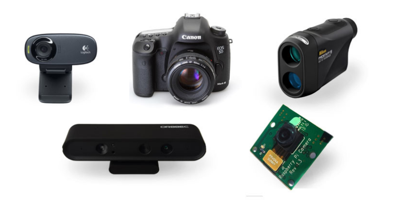

Computer sees the world as a grid of numbers. Even though those numbers in root are binary, so each number as seen here goes from 0-255, while actually each number is a binary: 255 = 0b11111111

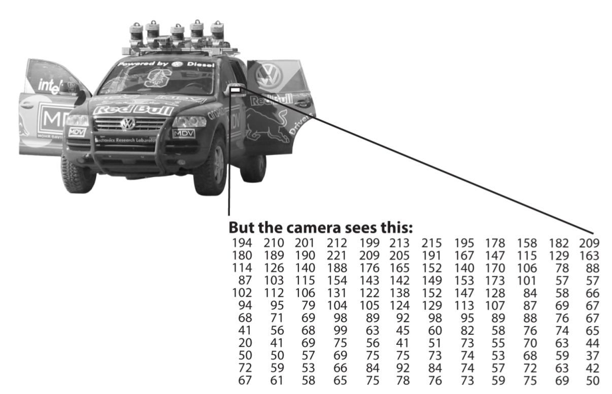

Or more precisely, every pixel is a three number list. 

Each number on the list represent three colors: Red, Green, and Blue.

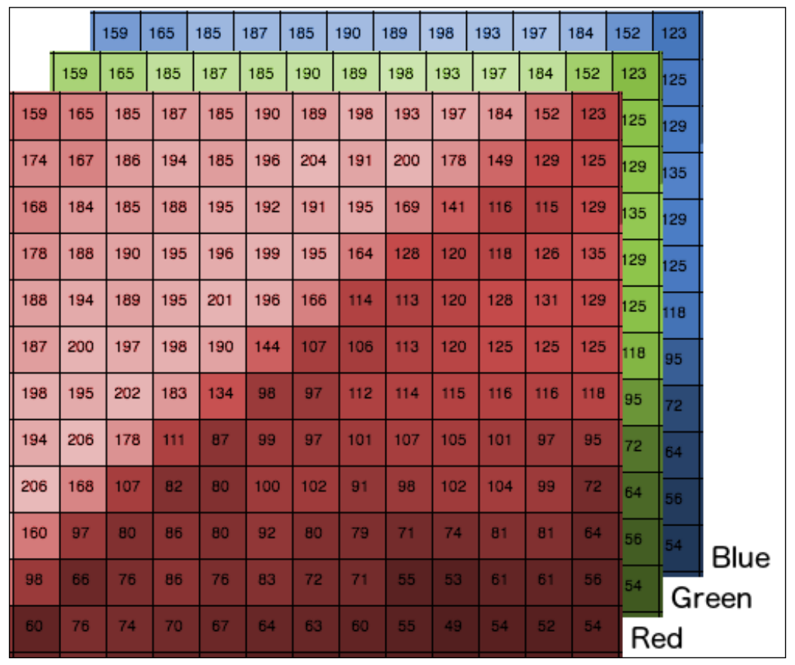

If we look the picture as a function then we can plot something like this:

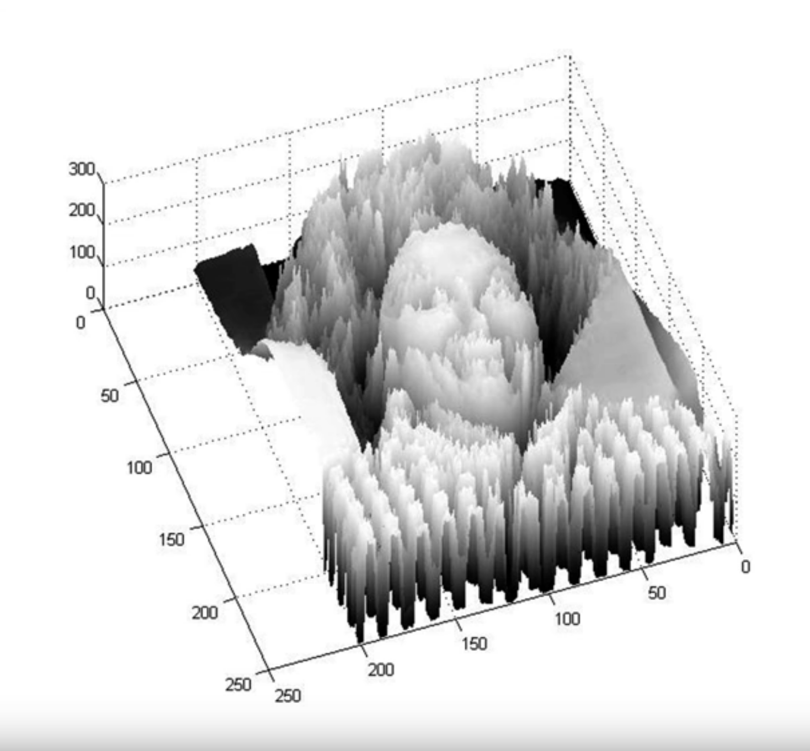

## Image processing

The second component of Computer Vision is the low-level processing of images. Algorithms are applied to the binary data acquired in the first step to infer low-level information on parts of the image. This type of information is characterized by image edges, point features or segments, for example. They are all the basic geometric elements that build objects in images.

This step usually involves advanced applied mathematics algorithms and techniques.

Low-level image processing algorithms include:

1. Segmentation
2. Edge detection
3. Feature detection
4. Classificationa

There are two kind of very distinctive operations in image processing:

- Point operators

  - Pixel transformation
  - Color transformation

- Correlation operators
  - Filtering and convolution

    ​

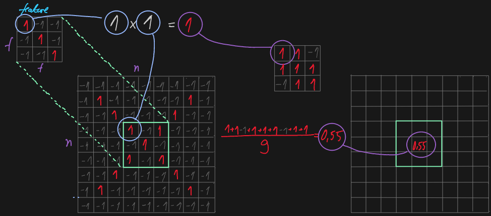

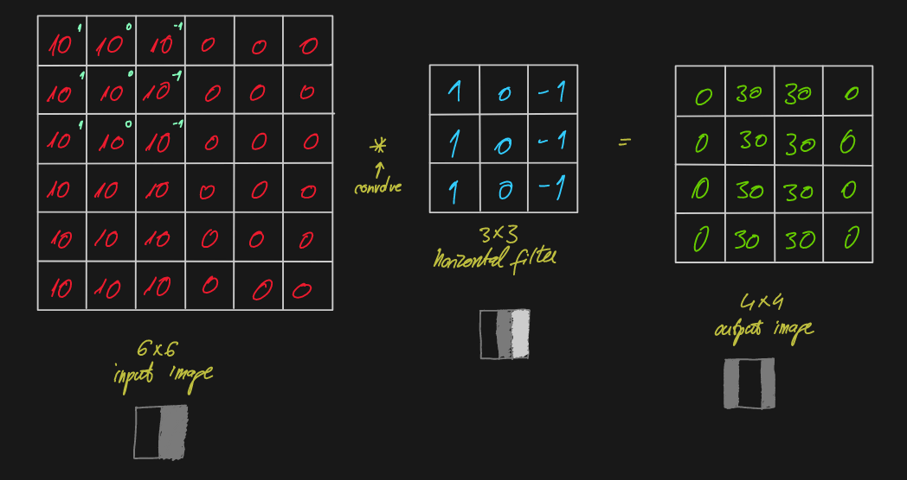

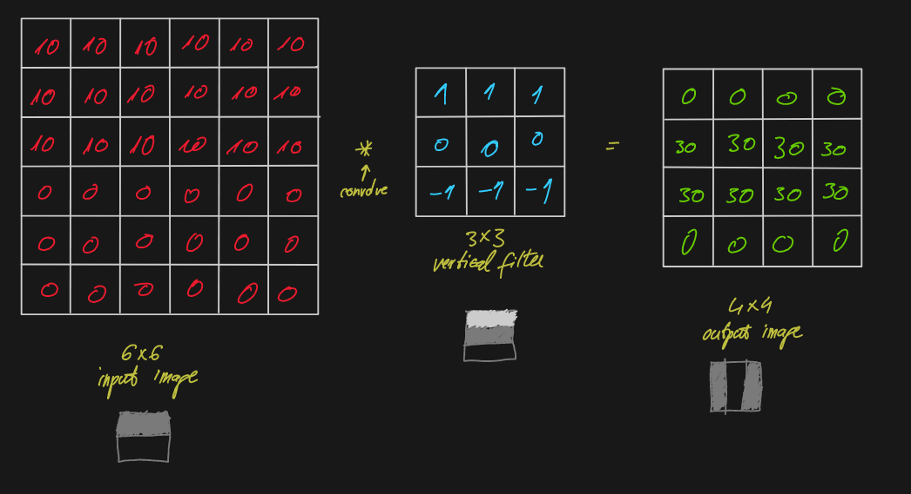

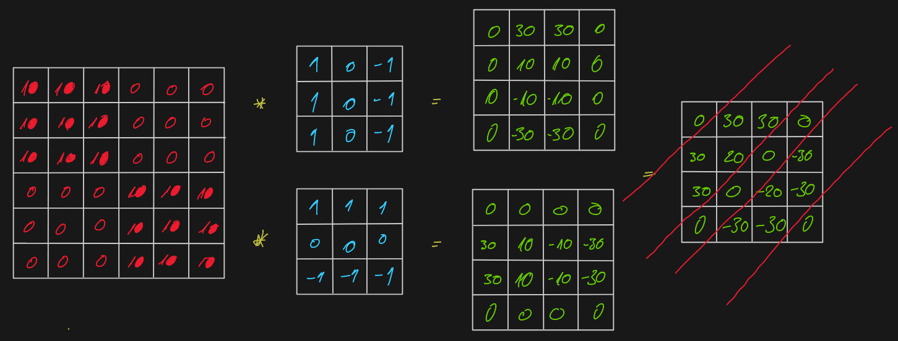

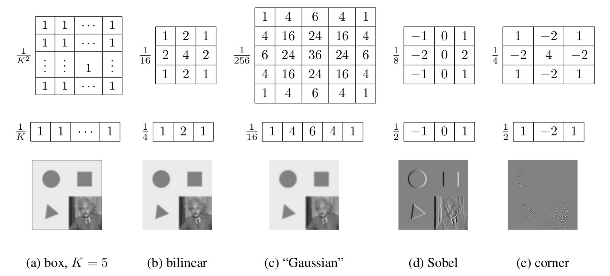

Bringing them all together:

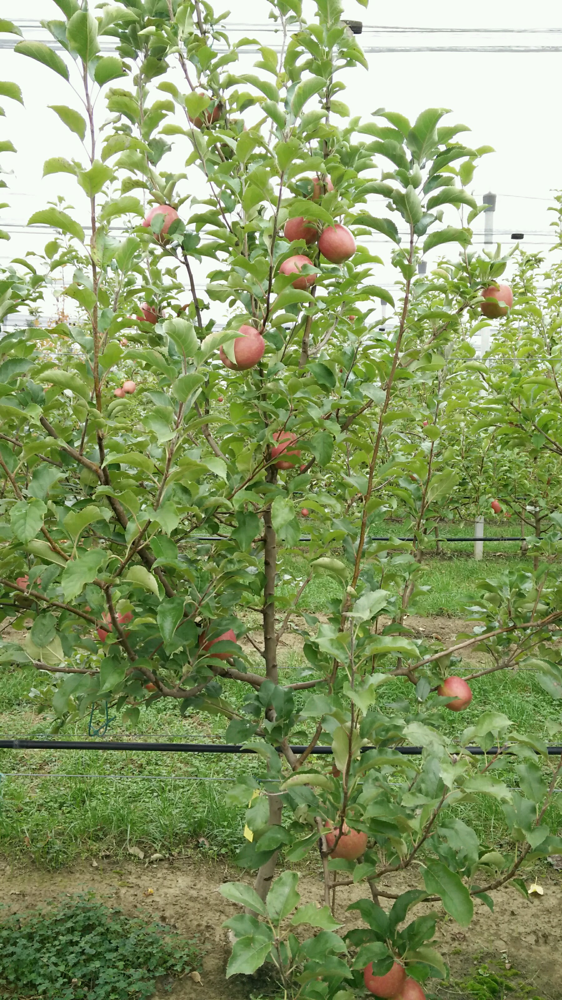

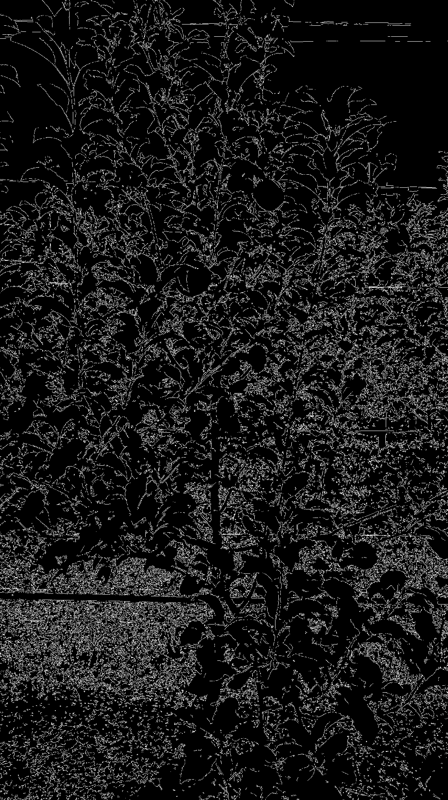

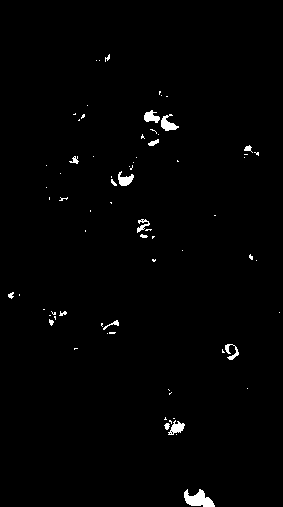

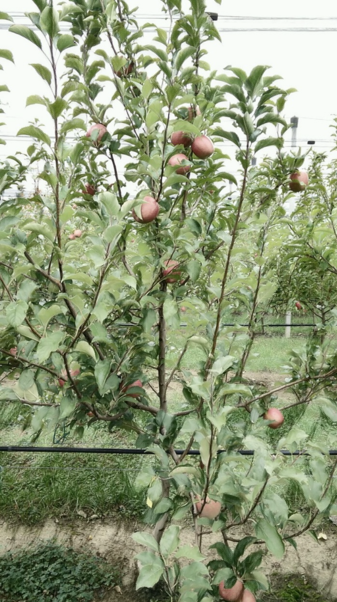

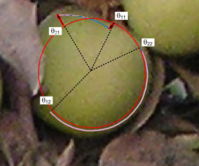

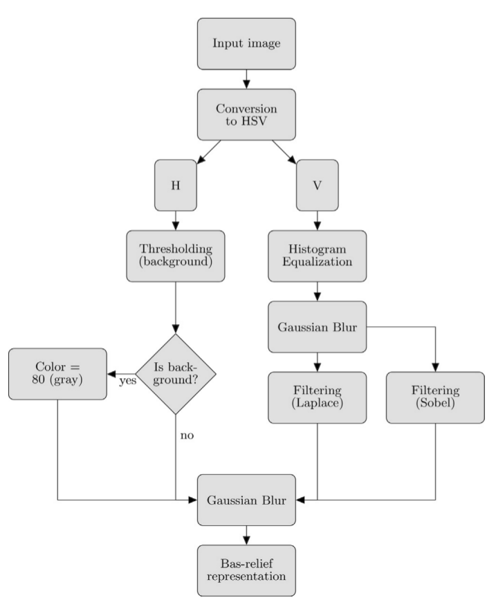

## Image analysis and understanding

The last step of the Computer Vision pipeline if the actual analysis of the data, which will allow the decision making.
High-level algorithms are applied, using both the image data and the low-level information computed in previous steps.

Examples of high-level image analysis are:

1. Scene mapping
2. Object recognition
3. Object tracking

