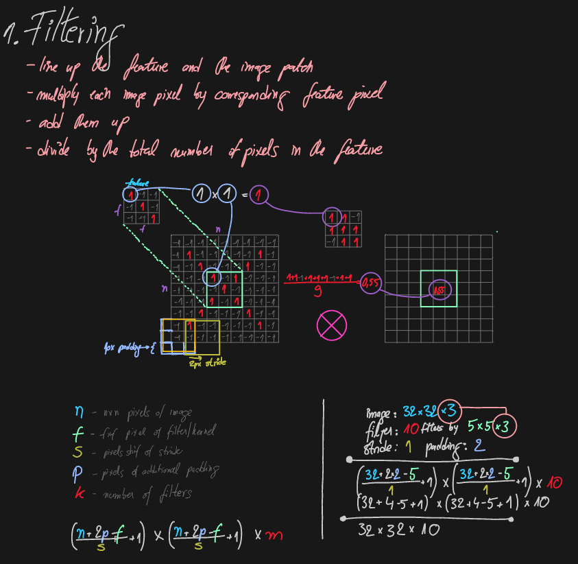

# Classic computer vision for apple detection
# Convolution neural networks for apple detection
# Robotics degree & future plans

---

# Computer vision

The goal of Computer Vision is to emulate human vision using digital images through three main processing  components, executed one after the other:

1. Image acquisition
2. Image processing
3. Image analysis and understanding

As our human visual understanding of world is reflected in our ability to make decisions through what we see, providing such a visual understanding to computers would allow them the same power :

## Image acquisition

Image acquisition is the process of translating the analog world around us into binary data composed of zeros and ones, interpreted as digital images.

Different tools have been created to build such datasets:

1. Webcams & embedded cameras
2. Digital compact cameras & DSLR
3. Consumer 3D cameras & laser range finders
4. Specialized thermal & multi spectral cameras 

Computer sees the world as a grid of numbers. Even though those numbers in root are binary, so each number as seen here goes from 0-255, while actually each number is a binary: 255 = 0b11111111

Or more precisely, every pixel is a three number list. 

Each number on the list represent three colors: Red, Green, and Blue.

If we look the picture as a function then we can plot something like this:

## Image processing

The second component of Computer Vision is the low-level processing of images. Algorithms are applied to the binary data acquired in the first step to infer low-level information on parts of the image. This type of information is characterized by image edges, point features or segments, for example. They are all the basic geometric elements that build objects in images.

This step usually involves advanced applied mathematics algorithms and techniques.

Low-level image processing algorithms include:

1. Segmentation
2. Edge detection
3. Feature detection
4. Classificationa

There are two kind of very distinctive operations in image processing:

- Point operators

  - Pixel transformation
  - Color transformation

- Correlation operators
  - Filtering and convolution

    ​

Bringing them all together:

The whole pipeline goes something like this:

## Image analysis and understanding

The last step of the Computer Vision pipeline if the actual analysis of the data, which will allow the decision making.
High-level algorithms are applied, using both the image data and the low-level information computed in previous steps.

Examples of high-level image analysis are:

1. Scene mapping
2. Object recognition
3. Object tracking

Another example:

# Deep learning and convolutional neural networks

## Neural networks - very -very -very (still very) simplified

Neural networks are just a massive number of functions trying to solve a problem.

- Perceptron (trying to simulate synapse)

  

  

  - Forward propagation

    - Input summation
    - soft-max 
    - activation function

  - Backward propagation

    - Error function

    - Gradient descent

      ​							**(We know the results of training set)**

  

  

  There are a lot of libraries, a lot. and are amazing, they take off you hands those complex math operations, and give you simple API. However for purpose of study i had to implement everything (as you can tell, those are my notes)

Classification: (million inputs from a 20mpx camera)

But if we use neural nets for pictures, we lose the spatial informations about it. Its very important for images to know where exactly is a pixel related to another pixel. And that why CNNs come to play.

## Convolutional neural networks (CNNs) or ConvNets

They have three main steps:

### Convolution step or Filtering

ConvNets derive their name from the [“convolution” operator](http://en.wikipedia.org/wiki/Convolution). The primary purpose of Convolution in case of a ConvNet is to extract  features from the input image. Convolution preserves the spatial relationship between pixels by learning image features using small squares of input data. We will not go into the mathematical details of Convolution here, but will try to understand how it works over images.

In CNN terminology, the 3×3 matrix is called a ‘**filter**‘ or ‘kernel’ or ‘feature detector’ and the matrix formed by sliding the 
filter over the image and computing the dot product is called the ‘Convolved Feature’ or ‘Activation Map’ or the ‘**Feature Map**‘. It is important to note that filters acts as feature detectors from the original input image.

### Spatial pooling

Spatial Pooling (also called subsampling or downsampling) reduces the dimensionality of each feature map but retains the most important information. Spatial Pooling can be of different types: Max, Average, Sum etc.

### Normalization and activation

Some networks:

LeNet - Plate recognition - 1998

GogLeNet - Inception modules (GOOGLE)

ResNet - Skip Connection (MICROSOFT)

Fully - Connected Layer

Tube CNN - 2017

**For amusement** - an example to show how powerful CNN can be:

#### Main techniques used in object detection and segmentation:

1. R-CNN and its derivatives

1. Mulitbox and its derivatives (SSD, YOLO ...)

## Now let's talk apples & pears

~50 Apples per tree

80-90% visible by eye

90-95% detected

~60 Pears per tree

60-70% visible by eye

90-95% detected

# Near-future plans, **future-future plans** and robotics degree

Near Future - Until April :/

1. Write the paper for International Precision Agriculture Symposium - Canada
2. Write the paper for ISHS - Turkey
3. ??? - Write the paper for Computers in Agriculture

Future-future plans:

1. Marie Curie Individual Fellowship (or) The crazy idea European project (Bru knows)
2. Second semester of my robotics program
3. Talk to Marco if they want to implement their algorithm with AI
4. Write the thesis

-- DRONE

-- ROBOTICS

first term:

project 1 - ROBOTIC OPERATING SYSTEM : https://www.youtube.com/watch?v=rDij00NB7pA

project 2 - KINEMATICS: https://www.youtube.com/watch?v=46RcDaRluGc

project 3: PERCEPTION: https://www.youtube.com/watch?v=v3lSNYWOniU

project 4: DEEP LEARNING

project 5: CONTROL: https://www.youtube.com/watch?v=lLcO5We0P6A

second term:

project 1: Robotics Systems Deployment

project 2: Localization

project 3: SLAM - Simultaneous Localization and Mapping

project 4: Reinforcement Learning for Robotics

project 5: Path Planning and Navigation

